[在 Mac 上快速提取视频中的音频文件](https://sspai.com/post/34250)  

[如何快速的提取视频文件中的音频](http://www.jianshu.com/p/a7971405a492)  

## 启动 Audio Hijack

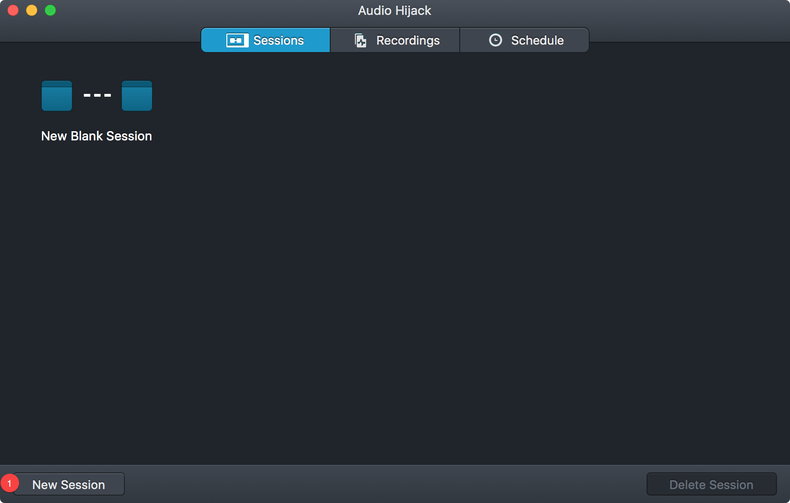

主页面由3个tab组成：

> 1. Sessions：会话  
> 2. Recordings：历史记录  
> 3. Schedule：录音计划(包含定时器等控制)  

默认在 `Sessions` 页，点击左下角的 **New Session** 按钮，可新建录制会话。

## 建立会话
### 会话模板
点击 **New Session** 按钮后，进入 `Template Chooser` 页面。

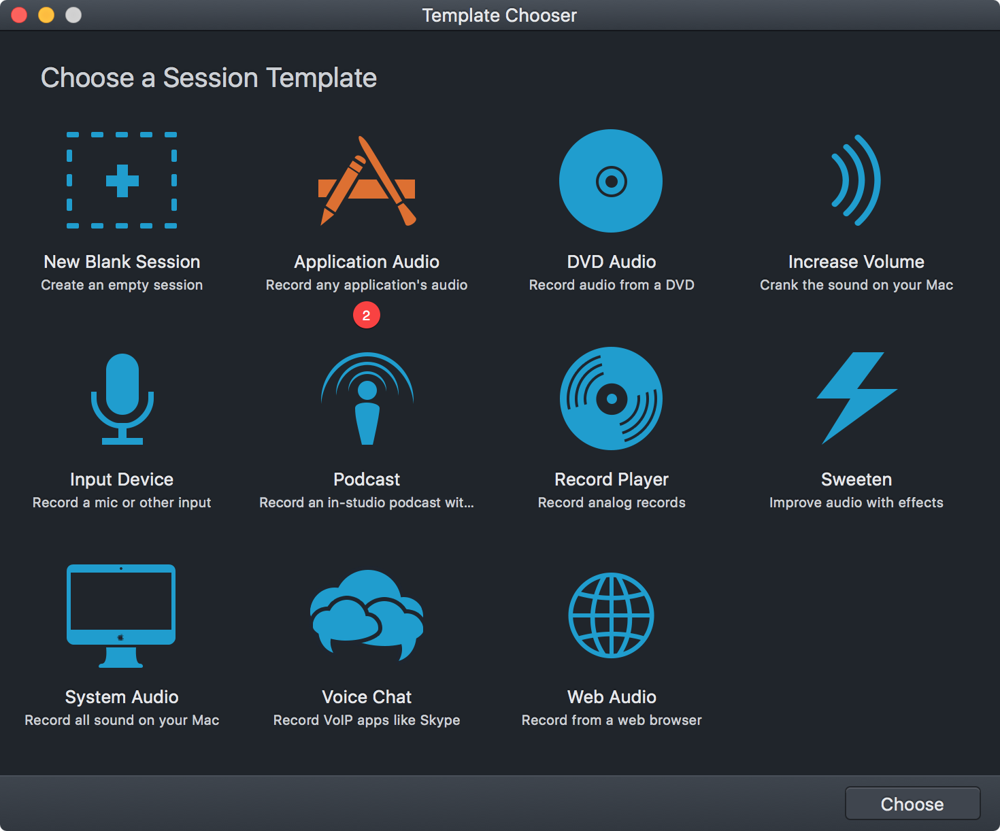

### 选择应用
点击 Application Audio，可选择本地应用作为录制声源（Record any application’s audio）。

默认选中的 Application 为 **iTunes**，点击 iTunes 图标，弹出 **Recent Application** 菜单，可选择最近应用作为声源（Source）。还可以点击 **Other Application** 选择本机安装的其他应用作为声源。

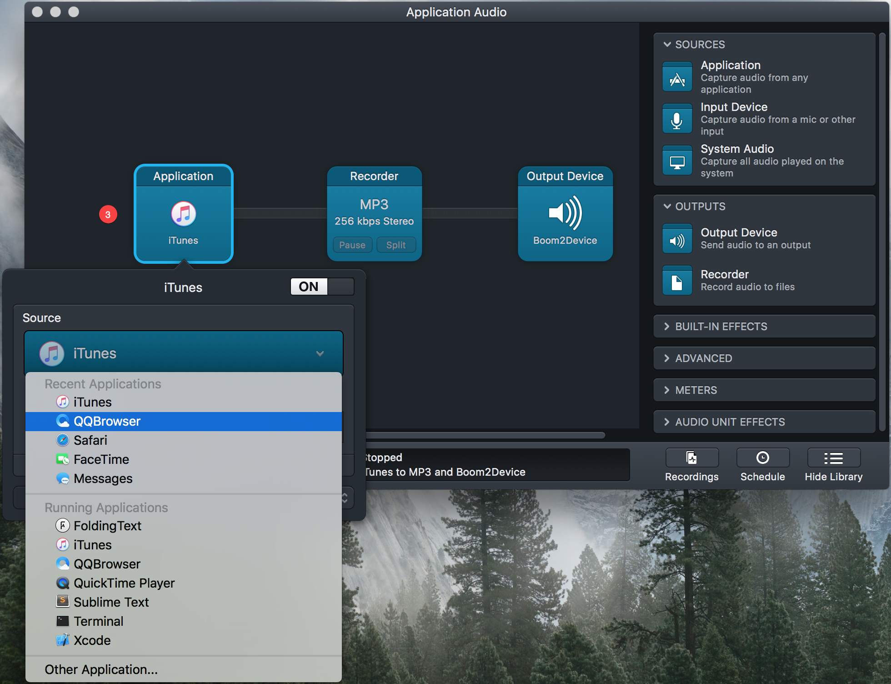

### 捕获浏览器播放音频
#### 设置 Source URL
选中 QQBrowser，点击弹出 Source 选项菜单，勾选 `Open URL`。  
我们将尝试捕获 `许巍-第三极` 官方 MV 的音频，其 URL 为：
 
<https://v.qq.com/x/page/l0377gwd78r.html>

在 URL 栏中填以上链接地址。

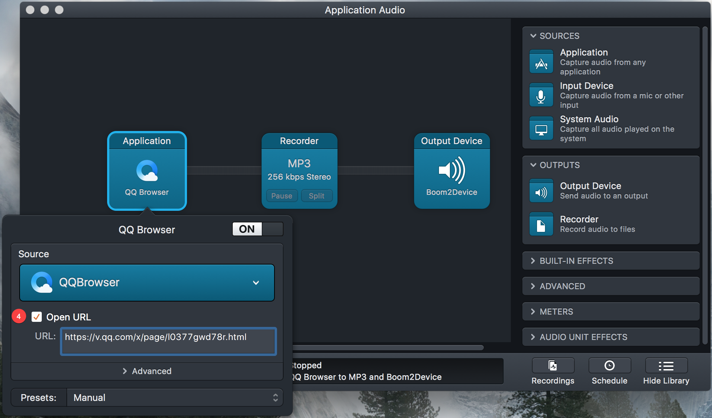

#### 开始录制
设置好 Source 后，点击左下角红色控制按钮，开始启动录制。Audio Hijack 将自动打开 QQBrowser 并跳转到指定 URL 网页。

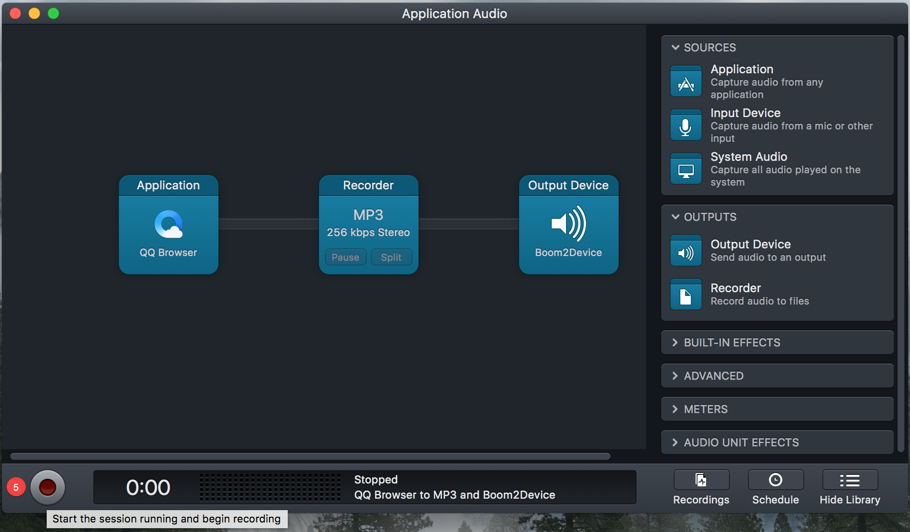

腾讯视频默认自动启动播放，开始录制。

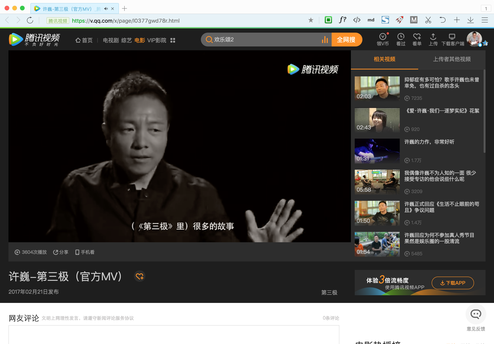

录制音频过程图如下：

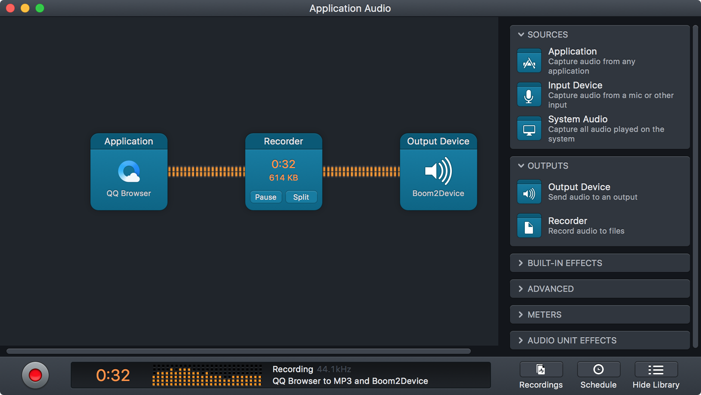

#### 停止录制
在播放 MTV 页面估计快播放到结尾时间点时，点击左下角红色控制按钮，将停止录制。

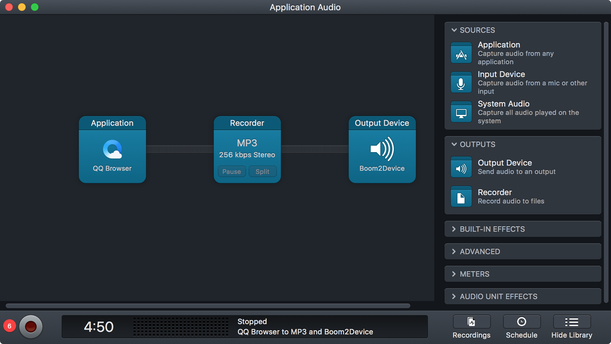

点击顶部的 **Recordings** 进入录制历史列表，可看到刚才录制的记录 `App Recording 20170520 0926`：

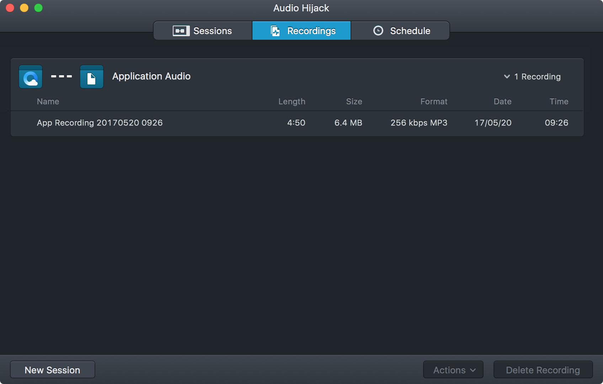

右键该记录条目，可选择 Reveal in Finder，在 Finder 中定位刚才录制保存的音频 MP3 文件：

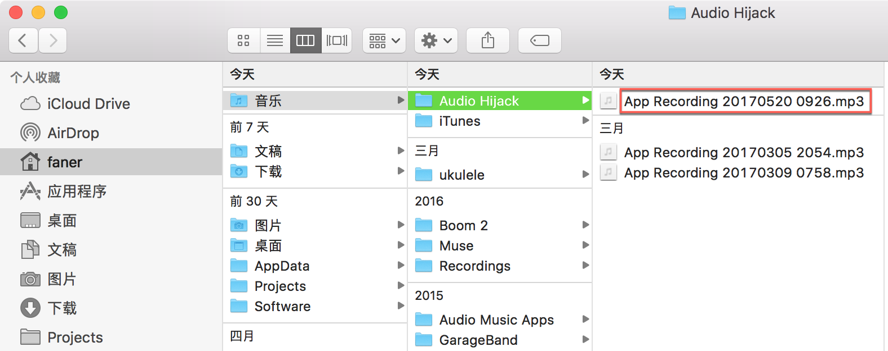

#### 编辑音频
一般打开网页到正式播放有一段加载延时，导致录制的前几秒可能是空白；中途可能有事出去了一会，回来后发现录制时长超过音频原长。

此时可将录制生成的 MP3 文件用 Quicktime Player 打开，然后打开菜单 `编辑|修剪`（<kbd>⌘</kbd><kbd>T</kbd>）对音频进行两端向中间拖动收窄（删除首尾空白）即可截取保留中间有效的音频时段。

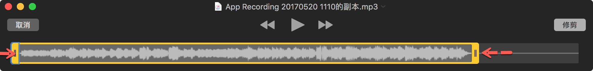

Quicktime Player 编辑后默认保存为 `MOV` 格式，也可选择导出仅音频 `m4a` 格式，再使用 Adapter、Permute、All2MP3 等工具转码为 MP3 格式音频文件。

## 会话历史
重新启动 Audio Hijack，打开的首页 Sessions 下可以看到之前录制的历史会话，点击可进入重新录制。

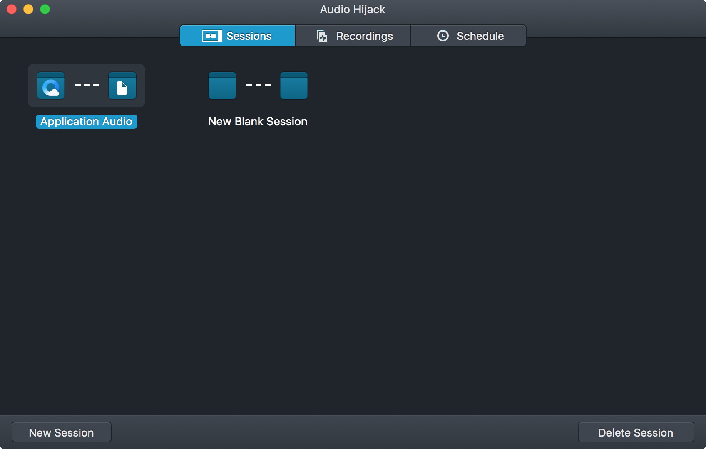

如果要录取其他网络音频，直接点击 QQBrowser 会话，参照第四步，可选填 Open_URL，录制 QQBrowser 音频或指定打开网页音频。
