<!--[TOC]-->

拍照充斥生活，“咔嚓”不绝于耳，捕捉流光溢彩，记录似水年华，定格美好回忆。  
屏幕截图，扫描提取，[即影即录即显](http://tech.sina.com.cn/t/2015-07-02/doc-ifxesftx9994102.shtml)；语音备忘，视频录制，[绘声绘色绘影](http://www.woshipm.com/pd/117066.html)。  
本文梳理汇聚了一批“声色”类应用，以满足日常多媒体处理及设计刚需。

## [如何从 iPhone 导出照片和录制的视频](https://support.apple.com/zh-cn/HT201734)
### 应用
#### [Image Capture](https://support.apple.com/kb/PH17894?locale=zh_CN)（[图像捕捉](https://support.apple.com/kb/PH6940?locale=zh_CN&viewlocale=zh_CN)）
“图像捕捉”在数码相机或[扫描仪](https://support.apple.com/en-us/HT204790)与您的 Mac 电脑之间传输图像。当带有摄像头的兼容设备连接到电脑时，可以使用“图像捕捉”来拍照。然后，您可以在 iPhoto 或 [Automator](http://www.weiosx.com/show-12-36-1.html) 中使用这些图像，或者通过网络共享这些图像。


<!--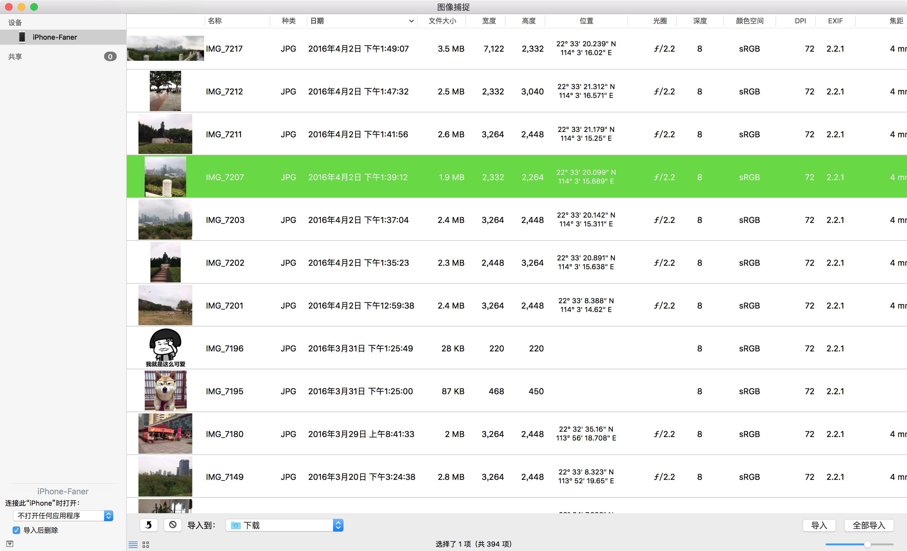-->

打开【图像捕捉】应用，选择要导入的已连接的 iPhone。点击底栏左侧下方的箭头按钮展开，可选择【连接此“iPhone”时打开】的应用程序，或选择【[不打开任何应用程序](https://support.apple.com/zh-cn/HT201399)】停用连接 iPhone 时自动弹出图像捕捉应用。

可选择以列表或图标格式浏览照片。在列表视图中，可直接查看常用的 [Exif](https://zh.wikipedia.org/wiki/EXIF)（Exchangeable image file format）信息，包括照片的高宽尺寸、地理位置坐标、光圈、深度、颜色空间、DPI、[EXIF](https://exif.cn/)、焦距、快门速度、ISO、闪光灯、制造商、型号等信息。

选中照片后，**双击**或点击右侧的【导入】所选和【全部导入】按钮，即可可执行导入；可下拉选择导入到的文件夹目录。若勾选【导入后删除】，导入后将删除手机相册中的副本，相当于剪切到了 Mac。

底栏有【逆时针旋转】操作按钮和【[**永久删除**](https://www.douban.com/note/356187246/)】所选项目操作按钮，【永久删除】按钮可以方便地在 Mac OS 上删除连接的 iPhone/iPad 设备相册中的照片或视频。

#### [iPhoto](http://www.apple.com/cn/mac/iphoto/)
iPhoto 是一款由苹果电脑为 OS X 操作系统和 iLife 软件套装编写，用于管理数码照片的应用软件。随着苹果 iPhone 与 iPad 的推出，苹果公司也推出了 iOS 版本的iPhoto。  


<!--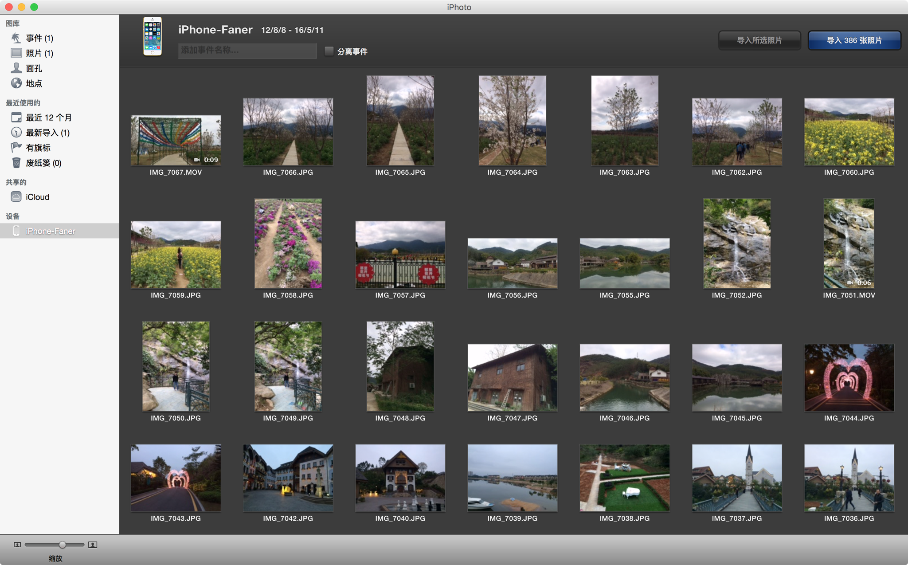-->

- 事件自动归类
	> iPhoto 能让你的照片按照事件自动分组。因此，你可以轻松找到你想要的照片。

- 张张面孔，对号入座
	> 为照片加上本人的名字，面孔功能即可自动提示其他可能包括此人的照片。  
	> 你甚至可以把面孔同步到你 iPad、iPhone 或 iPod touch 的照片 app 上。

- 地图上的亮点
	> 有了地点功能，你可以按照片的位置进行搜索和排序，还能在带有标准型、混合型或卫星视图的 Apple 地图上展现。

在偏好设置中，可配置 iCloud 勾选[我的照片流]和[照片共享]。

用户可以选择【导入所选照片】或【导入所有照片】。导入的照片（项目）将存放在 `~/Pictures/iPhoto\ 图库.photolibrary/Masters`，其下自动生成按 `年-月-日` 的分级目录。

#### Photos（[照片](http://www.apple.com/cn/osx/photos/)）
苹果专业级照片编辑应用 Aperture 以及消费级照片管理软件 iPhoto 已经停止开发，两款软件将携手退出历史舞台。OS X Yosemite 开始引入备受期待的 Mac 版全新照片应用，支持iPhone照片那种相簿管理以及导入、导出和分享。  
「照片」应用程序作为 [iPhoto 的接班人](http://www.feng.com/apple/osx/2015-02-06/Media-evaluation-of-OS-X-photos-application-compared-am-ascension-is-very-large_607316.shtml)，能够很好地[兼容 iPhoto / Aperture 照片图库](http://sspai.com/28810)。

在照片应用的偏好设置或 Mac OS 系统偏好设置（iPhone/iPad 设置）|iCloud 中，可配置 iCloud 选项，选择勾选[iCloud 照片图库]、[我的照片流] 或 [iCloud 照片共享]。有了 [**iCloud 照片图库**](http://www.apple.com/cn/icloud/photos/)，你能从你的设备访问 Mac 上的整个照片和视频图库。你使用 iPhone/iPad 拍摄的照片、慢动作视频和自拍照，也将自动添加至 [iCloud 照片图库](http://sspai.com/31553)，同时出现在你的 Mac、iOS 设备和 iCloud.com 上。在不同的设备上，你的照片集将以同一种方式整理归类。


<!--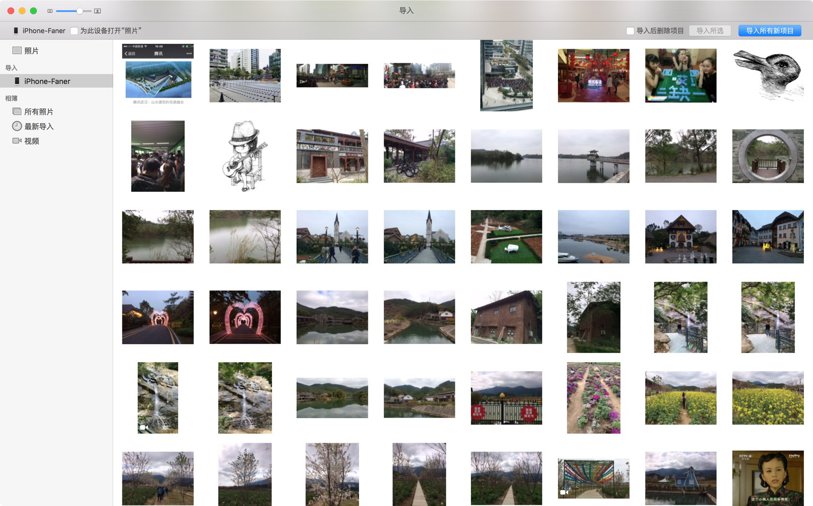-->

打开【照片】应用，选择要导入的已连接的 iPhone。若勾选【为此设备打开“照片”】，则只要连上该 iPhone，则 Mac OS 将自动启动照片应用。照片应用默认以缩略图格式浏览照片，可拖动工具栏上的滑竿放大或缩小缩略图。

右侧会显示“已导入”的项目和未导入的“新项目”，点击选中照片，可以【导入所选照片】或【导入新项目】。导入的照片（项目）将存放到 `~/Pictures/照片\ 图库.photoslibrary/Masters ` 目录，其下自动生成按 `年-月-日` 的分级目录。  
若勾选【删除项目】则导入后将删除手机相册中的副本，相当于剪切到了 Mac。

照片 app 可让你轻松对图像进行更高级的调整。对于已导入到 Mac OS 照片图库中的图片，选中相簿中已导入的图片，按下 enter 键（↩）或通过[图像|显示编辑工具]菜单可进入/退出编辑模式。默认支持增强、旋转、裁剪、滤镜、调整、润饰等编辑操作，还可以使用第三方扩展，如 [Pixelmator Distort](http://www.pixelmator.com/ios/user-guide/distort.php)。

选择增强功能，只需轻轻一点，即可让照片更出色。使用滤镜，让照片迅速呈现全新的面貌。或使用全新的智能滑块，即便初学者也能像专业人士一样快速编辑。智能滑块能让你一气呵成地调整照片的多个元素。

你可通过启用直方图、调节色阶、提高清晰度等操作进行精确编辑；还能添加晕影，为画面增加艺术感。

### [AirDrop](https://support.apple.com/zh-cn/HT204144)
- 打开照片应用，选择点击查看某张照片（视频），点击左下侧的分享箭头按钮。  
- 发现 Mac 设备（MacBook Pro）后，轻点以通过 AirDrop 分享。  
	- 如果是与 Mac 绑定同一账号的 iPhone，默认下载照片/视频（`IMG_*.PNG` / `IMG_*.MOV`）文件到当前账户的【下载】目录下。  
	- 如果非绑定账号的 iPhone，则 Mac OS X 上将弹出“来自 iPhone 的照片（视频）”确认弹框，点击【接受】按钮，下拉选择【存储到“下载”文件夹】或【在“照片”中打开】。


<!--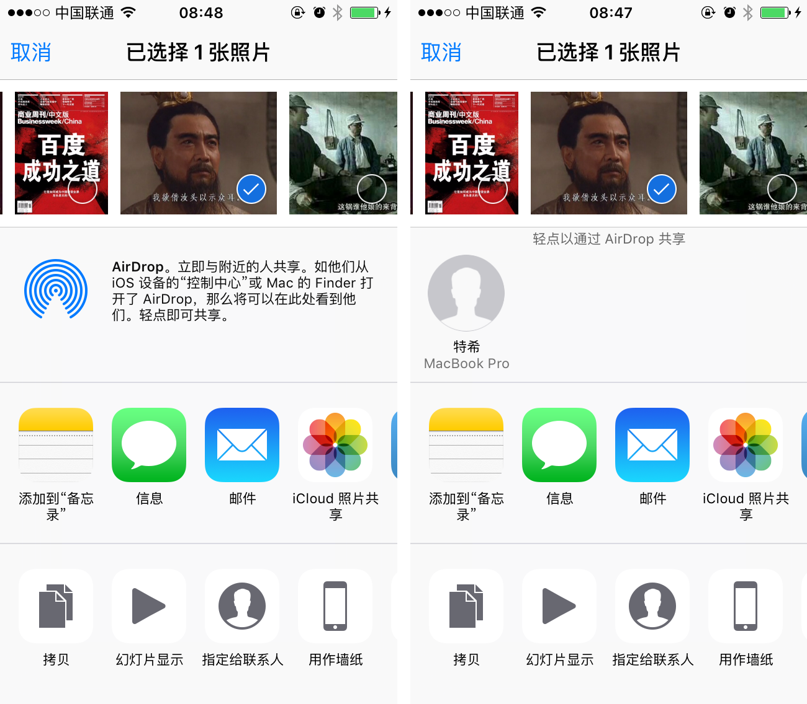-->


<!--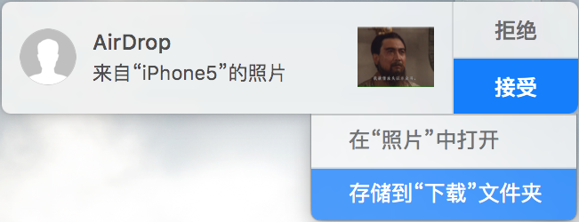-->

如果在开发过程中，要测试 iPhone/iOS 应用加载系统相册的速度，手动给相册拍摄照片会拍到手酸，可考虑使用 AirDrop 将 Mac 上的照片文件发送到 iPhone 相机胶卷。

> [将照片导入 iPhone 相机胶卷（Camera Roll）](http://bbs.feng.com/read-htm-tid-6287543.html)

### [iExplorer](https://www.macroplant.com/iexplorer/)
iExplorer 是一款专业的 iTunes 同步文件的工具，并且不需要越狱，能够帮助你将iPhone、iPod、iPad 中的音乐、电影以及播放列表直接导出至 Mac 及 iTunes。  
iExplorer 可以预览导出照片、短信、语音邮件、通讯录甚至是通话记录，提供像使用移动硬盘一样使用苹果设备的用户体验。


<!--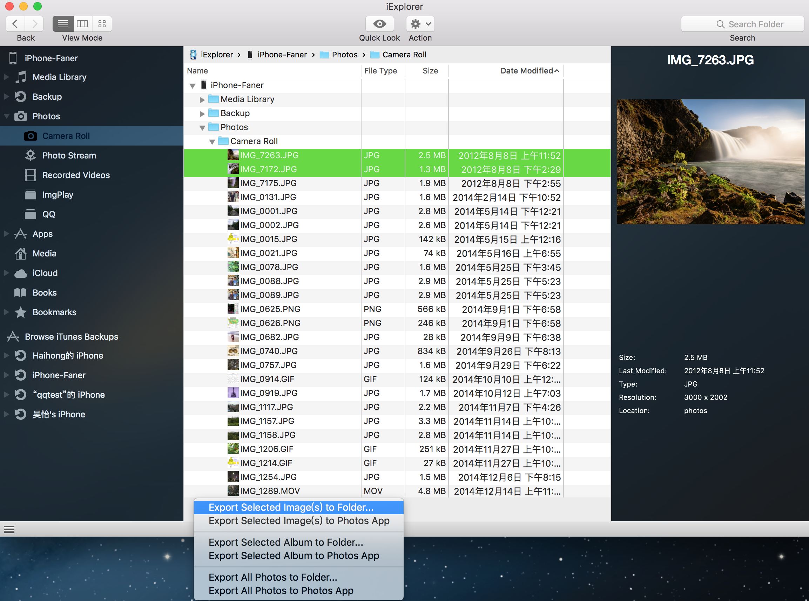-->

照片应用所在目录为 **`Photos`**，其下有以下目录：

- Camera Roll（照片，相簿|相机胶卷）
- Photo Stream（相簿|我的照片流）
- Recorded Videos（相簿|视频）

底栏【Export】按钮菜单可以选择将所选图片、相册或所有照片导出到指定文件夹（Folder）或照片应用（Photos App）：  

> **Export Selected** Image(s)/Album/All Photos **to** Folder/Photos App。

也可将 iExplorer 中的文件拖拽复制到 Finder 中。

> [iOS 获取系统相簿里边的所有照片](http://blog.csdn.net/komyself/article/details/8081012)  
> [iOS 开发之保存图片到相册(相机胶卷)](https://segmentfault.com/a/1190000003950935)  
> [如何通过Photokit保存图片（带有Metadata信息）到相册？](https://segmentfault.com/q/1010000004047993)  

## 如何从 iPhone 导出语音备忘录中录制的音频
### [AirDrop](http://blog.csdn.net/phunxm/article/details/43450167)
操作步骤同 AirDrop 传输照片。


<!--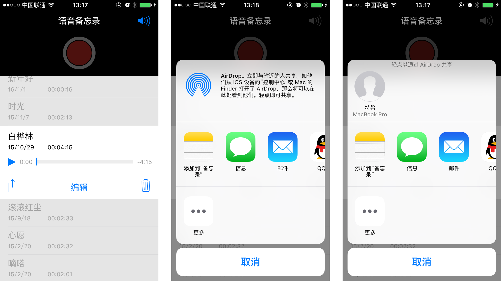-->


<!--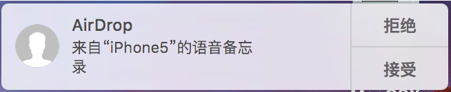-->

### [iExplorer](https://www.macroplant.com/iexplorer/tutorials/export-voice-memos-from-iphone-to-computer)
语音备忘录中录制的音频所在目录为 **`Media|Recordings`**，其中由录音日期（时分秒）命名的 composition 和 m4a 文件组成。在 **`Media Library|Voice Memos`** 目录下则可以看到命名的 Voice Memo 列表。


<!--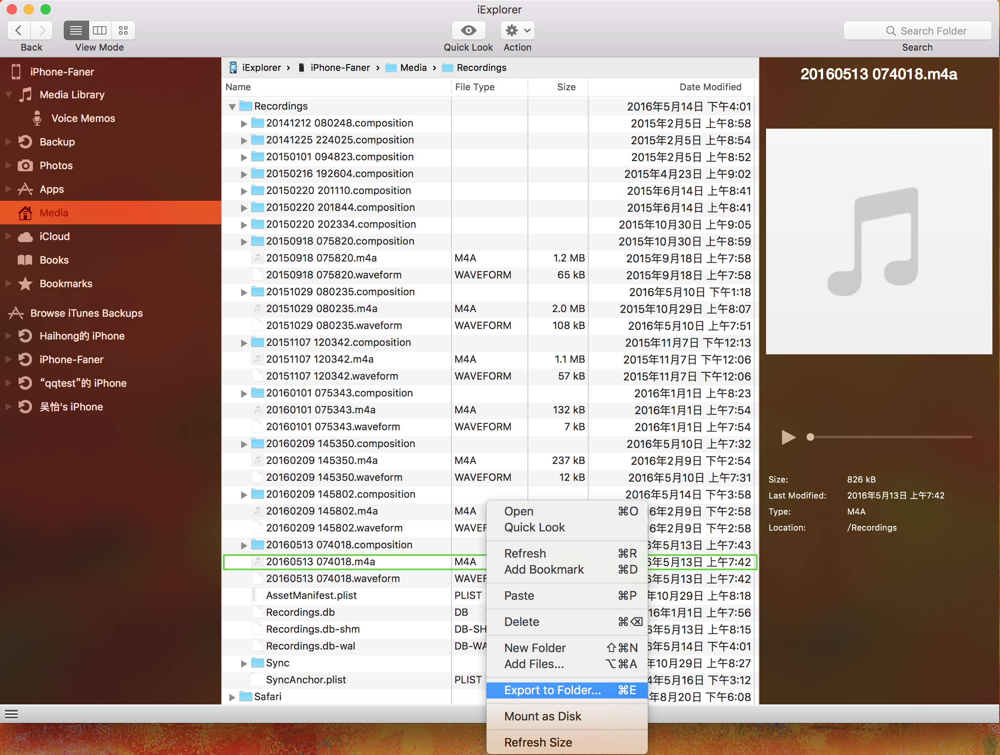-->

底栏有【Auto Transfer】和【Transfer from Device】按钮菜单。  
可呼出右键快捷菜单【Export Selected Items/Playlist to】，将所选音频/播放列表导出到 iTunes/Finder/Desktop。  
也可将 iExplorer 中的文件拖拽复制到 Finder 中。

## 图片处理
### 屏幕截图
#### [抓图](http://www.jianshu.com/p/9a55595ca78a)
苹果电脑自带的[抓图工具](http://blog.csdn.net/phunxm/article/details/17012939)，可拍摄整个或部分电脑屏幕的图片（屏幕快照）。熟练掌握其快捷操作可满足日常截屏需求。  
抓图除支持捕捉整个屏幕、部分屏幕、指定窗口，还支持[定时捕捉](http://www.feng.com/iPhone/news/2016-05-12/Mac-novice-skills-how-to-use-screen-timing-screenshot-function_646619.shtml)活动项目。

#### Fireshot
[Fireshot](http://www.oschina.net/p/fireshot/) 来源于截图软件开发商 Screenshot Studio，是一个 Firefox 扩展，用于创建[网页截图](http://www.appinn.com/awesome-screenshot/)。  
Chrome 浏览器应用商店中也有 **FireShot**，被评为“[2013年最好的免费谷歌Chrome扩展](http://www.pcmag.com/article2/0,2817,2397682,00.asp)”。

- 捕捉选定区域
- 捕捉可见部分
- [捕捉整个页面](https://www.zhihu.com/question/20075570)

### [查看预览](https://support.apple.com/zh-cn/HT201740)
【预览】应用支持从剪贴板中创建一个新文件，支持双指旋转，支持 PDF 文件和图片文件格式互导。

在 Mac 中，除了调用 【预览】应用可打开单张图片，也可在 Finder 中使用 space 空格键快速预览。若在[偏好设置](http://bbs.feng.com/read-htm-tid-4966791.html) 中选择“在一个窗口中打开所有文件”，则可方便地打开文件夹中的一组图片。      
【预览】应用除了提供简单的预览功能外，还支持基础的区域选择剪切（Crop）操作、速写和文本，以及添加形状和放大效果。


<!--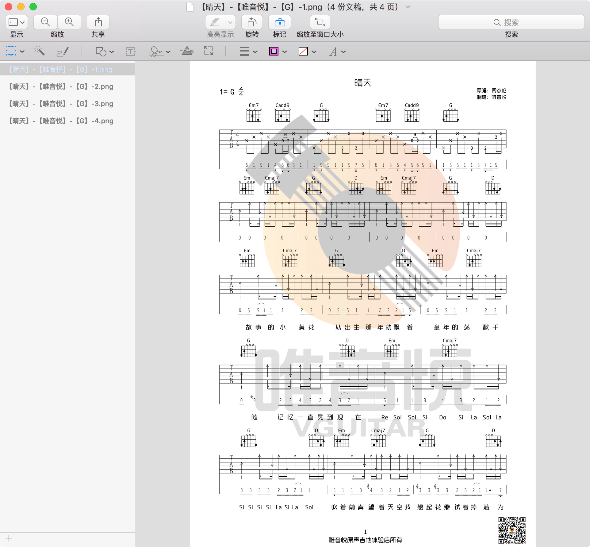-->

> [用好 Mac 内置的预览应用](http://www.ithome.com/html/mac/153028.htm)  
> [如何使用「预览」提取 Mac 应用程序图标](http://sspai.com/25935)  

Mac 下的 [PaintBrush](http://paintbrush.en.softonic.com/mac/download#downloading) 软件类似于 Windows 下的"画图"，适合做一些轻便标注或做简单的隐私处理。

> [Simple Comic for Mac](http://simple-comic.en.softonic.com/mac)：操作便捷，轻量级，速度快。  
> [五大漫画专用阅读工具](http://pcedu.pconline.com.cn/pingce/0708/1086360.html)：[MangaMeeya](http://pcedu.pconline.com.cn/pingce/0708/1086360_1.html)，[Hamana](http://pcedu.pconline.com.cn/pingce/0708/1086360_3.html)

### [图片压缩](https://free.com.tw/compressor-io/)
#### Online Resizer
[在线图像优化器](http://optimizilla.com/zh/)：[JPEG压缩](http://compressjpeg.com/zh/) / [PNG压缩](http://compresspng.com/zh/) / [tinypng](https://tinypng.com/) / [punypng](http://www.punypng.com/) / [Web Resizer](http://webresizer.com/resizer/)  
图片在线压缩工具：[图好快](http://www.tuhaokuai.com/image) [色彩笔](http://www.secaibi.com/tools/) [IloveIMG](http://www.iloveimg.com/zh_cn) [动态图片基地](http://www.asqql.com/gifzip/)

#### ImageOptim
[adjusting](http://www.pixelmator.com/tutorials/image-editing-basics/changing-image-size/)/[resampling](http://www.pixelmator.com/tutorials/image-editing-basics/image-size-and-resolution/)/compress/resize Image with [**Preview**](https://alums.vassar.edu/images/volunteer/image-reductions-in-preview.pdf) or [**Pixelmator**](http://www.pixelmator.com/tutorials/tools/resize-images/)  
[**ImageOptim**](https://imageoptim.com/mac)：makes images load faster

### 扫描提取
在某些场景下，我们希望提取扫描或截屏图片中的文字，方便加工编辑。显然，通过人眼识别手工输入效率奇低，专业的 OCR（ Optical Character Recognition） 扫描识别提取软件可满足此类需求。

#### [ABBYY FineReader](http://www.abbyy.cn/finereader/)
ABBYY FineReader 是世界排名第一的 OCR 图片文字识别软件工具，提供高效和精准的文档识别、数据提取解决方案，支持多国字符和彩色文件识别，主要用于将扫描图像、图片型 PDF 转化成可编辑的文本。

ABBYY FineReader 支持23种界面语言，多达189种OCR识别语言，包括其中几种语言的混合识别和结构复杂的文字识。对于英文的识别可以说是高达99%，而汉字的识别也在99%。  
不过，专业的OCR识别技术意味着软件体积的增大，如果需要轻量级OCR解决方案，可以使用 [Able2Extract](http://www.investintech.com/prod_a2e_pro.htm)，就是只支持英文语言识别比较遗憾，不过 [CAJViewer](http://cajviewer.cnki.net/) 提供了比较方便易用的中文OCR技术。

#### Extractor
[PDF & Image Text Extractor](https://itunes.apple.com/us/app/pdf-image-text-extractor/id966794154?mt=12)——将PDF文档或者图片里的文字信息提取成TXT  
[Text Extractor](https://itunes.apple.com/us/app/text-extractor-extract-text/id693899907?mt=12) - [Extract](http://www.iplaysoft.com/free/textextractor) text from PDF & Image with OCR  
[OCR-text from image](https://itunes.apple.com/cn/app/ocr-text-from-image/id553501720?mt=12) - recognize and extract text from document image

#### OnlineOCR
[Free-OCR.com](http://www.free-ocr.com/) is a free online OCR tool  
[ExtractPDF.com](http://www.extractpdf.com/) extract Images, Text or Fonts from a PDF  
[Online OCR](http://www.onlineocr.net/) - FREE ONLINE OCR SERVICE，支持中文。


<!--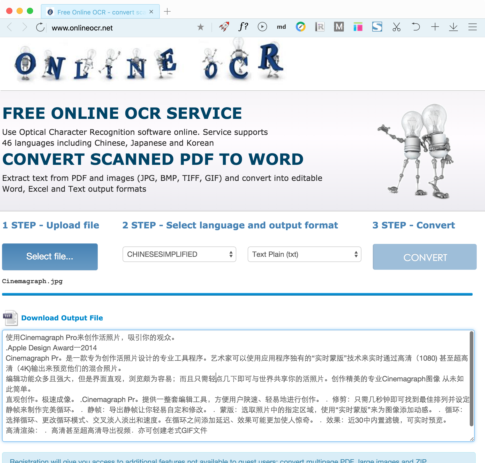-->

### 专业绘制
#### [Sketch](http://www.sketchapp.com/)
[Sketch](http://www.pc6.com/mac/111315.html) 是一款轻量（lightweight），易用的（easy-to-use ）**矢量制图设计**工具。矢量绘图也是目前进行网页——特别是移动应用设计，图标以及用户界面设计的最佳方式。因其出色的设计、良好的体验和强大的功能，该软件荣膺 [Apple Design Award Winner & Among App Store's Best of 2012](http://www.macrumors.com/2012/06/11/2012-apple-design-award-winners-announced/)。

Sketch 主要用于满足数码产品（digital design） [UI](http://www.cocoachina.com/design/20141204/10529.html)/[UX](http://www.woshipm.com/pd/854.html) 设计效果图的需求，可搭配 [OmniGraffle](https://www.macstories.net/news/design-your-next-iphone-app-with-omnigraffle-sponsor/) 辅助。对于绝大多数数字产品的设计，Sketch 完全可以替代 Photoshop、Illustrator 和 Fireworks 等老牌重量级工具。

Sketch 简约的设计是基于无限的规模和层次的绘图空间，免费调色板，面板，菜单，窗口和控件。虽然使用简单，但 Sketch 提供了功能强大的矢量绘图和文字工具。完美的布尔运算，符号，和强大的标尺、参考线和网格等功能支持，让 UI/UX 设计更简单，更高效。

Sketch 中没有画布的概念，整个空白区域都可进行创作，因为它是基于矢量的。但在某些时候，我们需要一个“框”（bounds/frame），来具象化我们的设计。在 PhotoShop、Pixelmator、OmniGraffle 及其他设计软件中，称作画布；但在 Sketch 中，它被赋予了一个新词，叫做 artboard（艺术板）。


> [Sketch 中国](http://www.sketchs.cn/tutorials.html) / [Sketch 中文网](http://www.sketchcn.com/) / [Sketch 资源库](http://sketch.im/)  
> [Sketch 3用户操作指南及实战案例全解](http://yuedu.baidu.com/ebook/20e94b0c1711cc7930b71671?fr=aladdin&key=sketch)  
> 
> [玩转 Sketch 系列文章一：进入一个全新的时代](http://www.waerfa.com/sketch-skills-series-chapter-one)  
> 从零开始学APP设计利器SKETCH（[一](http://www.uisdc.com/sketch-app-design-case)）([二](http://www.uisdc.com/sketch-app-design-case-2))  
> [学习使用 Sketch 着手设计自己的 APP](http://www.jianshu.com/p/c2946a9869ed/)
> 
> [如何高效使用Sketch](http://www.starming.com/index.php?v=index&view=37)：[1](http://www.uisdc.com/9-sketch-features-for-webdesign) [2](http://www.jianshu.com/p/b579b87196bd)  
> [从零开始学Sketch——入门篇](http://www.woshipm.com/pd/258898.html)  
> [Sketch 界面设计入门和实战](http://www.jikexueyuan.com/course/543.html)  
> [Sketch-Toolbox](https://github.com/shahruz/Sketch-Toolbox)：[插件扩展](http://www.uisdc.com/sketch-useful-plugins)

#### [Pixelmator](http://www.pixelmator.com/tutorials/)
Pixelmator 是一款 Mac 平台上的**图像处理**软件，其主要功能和 Adobe 系列的 PhotoShop 类似。但相对于 Adobe Photoshop 来说，Pixelmator 是一款轻量级修图软件。在界面交互和流畅感上均优于 Photoshop，熟悉 Photoshop 的人可迅速上手。

[Pixelmator](http://macshuo.com/?p=1114) 简约而不简单，完全符合 Apple 生态系统[简洁、有力、实用和美]的软件哲学和设计思想，荣膺 [Apple Design Award](http://www.pixelmator.com/ada/) of [WWDC 2011](https://www.macstories.net/news/the-best-of-the-best-apple-design-awards-2011/)。

Pixelmator 拥有整洁清爽且易于操作的界面，支持灵活可调整的画布（Resizable Canvas）和丰富的[图层](http://www.pixelmator.com/tutorials/image-editing-basics/layers-in-image-editing/)组合（[Layer/Group](http://www.pixelmator.com/tutorials/image-compositions/layer-groups/)），可以标尺（Rulers）和网格（Grid）实时显示像素点的坐标和 RGB 等图元信息。  

- 支持常见的 PSD、TIFF、JPEG、PNG、PDF、EPS 等图形文件格式；
- 足可与 Photoshop 匹配的选取、渐变、笔刷、填充、裁切，甚至魔术棒工具等功能；
- 提供 50 多种专业的滤镜，以及系统预设的调色板以及字体资源；
- Photo Browser 可让用户直接从 iPhoto 导入相片。


<!---->

**pxm** 是 Pixelmator 专有的光栅图像格式，包含多个图层、图层蒙版、色彩校正设置和图像元数据，是一种无损格式，保存时不会丢失质量的文件。默认保存为 PixelMator 文件格式(*.pxm)时，重新打开可针对图层对象及元素进行再编辑。最终效果图可导出其他文件格式，但再次打开将无图层信息，无法进行持续编辑。

> [Pixelmator 官方教程](http://www.youku.com/playlist_show/id_22561811.html)：[Mac](http://support.pixelmator.com/mac)/[iOS](http://www.pixelmator.com/ios/tutorials/)  
> [Pixelmator 使用教程](http://www.vipcn.com/shoujisoft/shoujizixun/394775.html)  
>
> [Pixelmator 成长的故事](http://iphone.tgbus.com/news/class/201311/20131111092452.shtml)  
> [Pixelmator：从此修图不再叫做 “PS”](http://www.waerfa.com/pixelmator-review-again)  
> 
> [iOS掌上图片处理之王：Pixelmator](http://www.waerfa.com/pixelmator-for-ios-full-review)  
> [令iPad更强大的修图软件：Pixelmator](http://game.feng.com/game/infoDetail/2015-01-01/make_ipad_more_powerful_graphic_software_pixelmator__85070.shtml)  
> [Pixelmator – 如何使用形狀工具 (Shape Tool)](http://appleday.cc/archives/562)  

#### [OmniGraffle](https://www.omnigroup.com/omnigraffle/)
OmniGraffle 是大名鼎鼎的 [OmniGroup](https://www.v2ex.com/t/33323) 设计的 Omni 系列办公精品之一，是 Mac 平台下优秀专业且简洁易上手的 visio 级制图软件。该软件也曾入围 Apple Design Awards。

- Create Anything
- Design how you like
- All the extras
- Work how you like

OmniGraffle 具有以下特性：

- 丰富的绘图元素、线型和模具；
- 可自由伸展的画布，灵活的图片蒙版；
- 支持图片的直接拖拽，能仅导出选中对象为图片。

OmniGraffle 具有以下功能：

- 连接、形状、颜色、填充、磁化多边形。
- 家居空间计划建筑设计。
- Mac/iOS/[Konigi](http://konigi.com/tools/omnigraffle-wireframe-stencils/) 线框图。
- 程序流程图和 UML 建模图。

基于以上功能特性，OmniGraffle 可满足日常 [Web 线框图](https://speckyboy.com/2015/04/15/using-omnigraffle-for-web-design/)、APP 原型图、设计流程图和软件 UML 图等绘制需求。


> [创建更好的移动 Demo:工具篇](http://isux.tencent.com/make-better-demo.html)  
> [UX基础 - OmniGraffle新手指南](http://beforweb.com/node/202)  
> [OmniGraffle 加速原型设计](http://isux.tencent.com/speed-up-wireframing.html)  
> 
> [使用 OmniGraffle 制作原型图](http://www.cnblogs.com/cocowool/p/3451927.html)  
> [Omnigraffle 技巧整理](http://www.jianshu.com/p/SxvBzK)  
> [10個你應該知道的 Omnigraffle 的使用技巧](http://blog.csdn.net/Hynial/article/details/47109701)  
> [OmniGraffle 中文使用教程技巧分享](http://blog.csdn.net/hynial/article/details/47108971)  
> [思维利器 OmniGraffle](http://www.jianshu.com/p/ccc8d64c7202)  
> 
> OmniGraffle 教程 [（一）](http://www.jianshu.com/p/707446271c08)[（二）](http://www.jianshu.com/p/f845d9420adb)  
> 
> [OmniGraffle （一）从工具栏开始](http://www.jianshu.com/p/52f3ecbe8f2d)  
> [OmniGraffle （二）对象的控制](http://www.jianshu.com/p/bef7f6272c10)  
> [OmniGraffle （三）基础绘图和模具](http://www.jianshu.com/p/a422e2e2ea8b)  
> [OmniGraffle （四）化繁为简](http://www.jianshu.com/p/48678f96ee52)  

### [测量标注](http://www.jianshu.com/p/4e0ef5864e70)
**Pixelmator** 可以显示坐标标尺（Show Rulers）和网格（Show Grid）；信息栏（Info Bar）可显示光标像素点的 RGB 和坐标信息。参见《[resizableImageWithCapInsets](http://blog.csdn.net/phunxm/article/details/42150469)》。

[**OmniGraffle**](http://www.jianshu.com/p/48678f96ee52) option 点击线条，可在**线条标签**中插入变量-[线条长度「Line Length」](http://forums.omnigroup.com/showthread.php?t=10838)。此时，线条就变成了测量标尺，间接实现了标注。

**Sketch** 也支持显隐标尺，在标尺上双击可以添加参考线。选中某个 artboard，然后按下 alt(option) 键的同时移动鼠标到其他 artboard 上，智能型参考线（Smart Guides）便会显示出来，即可便捷地查看所选对象和其他对象间的间距。

<!--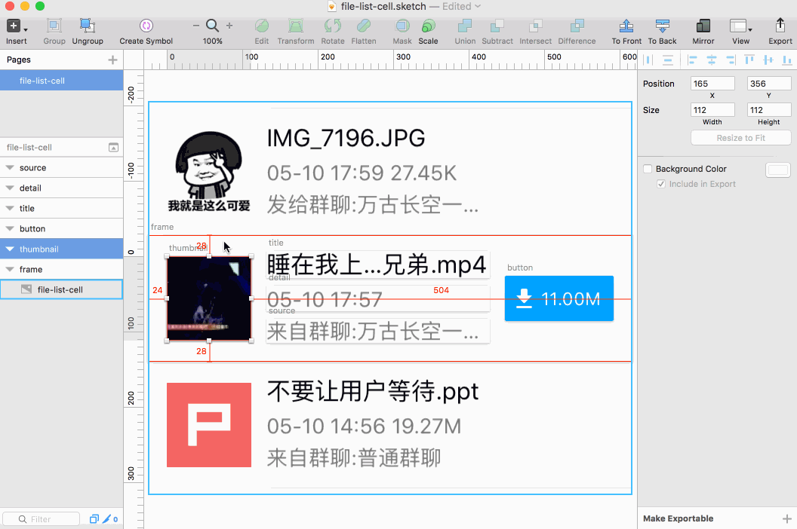-->


Sketch 实现了软件内的智能标记，也可使用[标注神器插件](http://www.ui.cn/detail/17548.html)——[utom](http://www.kejik.com/article/12753.html)/[sketch measure](https://github.com/utom/sketch-measure/)。参见[《iPhone屏幕尺寸、分辨率及适配》](http://blog.csdn.net/phunxm/article/details/42174937)中的UI相对布局示范标注。

#### Pixel Ruler（像素测量）
- Mac：[PixelTools](https://itunes.apple.com/us/app/pixel-tools/id491736717?mt=12)、[PixelStick](http://plumamazing.com/mac/pixelstick/)、[Omnidea](https://itunes.apple.com/app/rulers/id415310758?mt=12)、[UIStencils](http://www.uistencils.com/products/pixel-ruler)
- iOS&Android：[Pixel Ruler(PX-DP)](http://www.pixel-ruler.net/) 
- Windows：[the Screen ruler](http://www.pixelruler.de/e/download.htm)

#### MarkMan（尺寸标注）
[**MarkMan**](http://www.getmarkman.com/)（[马克鳗](http://www.appinn.com/markman-air/)）是高效的[设计稿](http://www.xuanfengge.com/featured-a-design-tool-dm-markman-eel.html)标注、测量工具。  
[**Dorado**](http://cdc.tencent.com/2010/12/01/%E4%B8%80%E7%A0%82%E4%B8%80%E4%B8%96%E7%95%8C%EF%BC%8C%E4%B8%80%E8%8A%B1%E4%B8%80%E5%A4%A9%E5%A0%82%EF%BC%9A%E5%BE%AE%E5%9E%8B%E8%AE%BE%E8%AE%A1%E4%B8%93%E7%94%A8%E5%B7%A5%E5%85%B7dorado/) 是一款用起来比 MarkMan 更方面更灵活的[网页设计标注工具](http://www.appinn.com/dorado/)。  
[**SnapRuler**](http://www.snaprulerapp.com/)：[尺寸测量专用好帮手](http://www.waerfa.com/snapruler)。不光能精确测量网页和界面尺寸，还能自定义其他测量尺寸来测距房屋图纸、建筑设计图等，实乃数字测量神器！

#### Serial & Watermark（编号水印）
[**Snagit** for Mac](https://itunes.apple.com/us/app/snagit/id492729790?mt=12) 是一款集截图、录屏和编辑于一身的[屏幕捕捉截图工具](http://www.waerfa.com/snagit)，可轻松抓取图像、文本和影音等多种内容形式。可在图片上进行文字插入、边框修饰、滤镜美化、箭头标注、编号标注、图形插入和橡皮擦等十余种后期编辑操作。

[**iWatermark**](http://plumamazing.com/)（[Mac](http://plumamazing.com/mac/iwatermark-pro/)/[iOS](http://plumamazing.com/iphoneipad/iwatermark-pro/)/[Android](http://plumamazing.com/android/iwatermark-pro/)/[Win](http://plumamazing.com/win/iwatermark-pro/)）：iWatermark 是最受欢迎的专业为照片添加水印的工具（The worlds Number 1 Watermarking App）。

## 音视处理
### [All2MP3](http://www.all2mp3.com/)
iPhone 语音备忘录中录制的音频文件后缀是 [m4a](http://baike.sogou.com/v257430.htm)（为MPEG-4音频标准文件的扩展名）。可使用 [All2MP3](http://www.mac52ipod.cn/post/convert-wav-wma-and-other-audio-video-format-to-mp3-on-mac-os-x-all2mp3.php) 这个软件工具将其转换为 mp3 格式。


<!--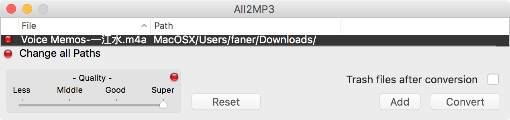-->

> [iOS 音乐合成（混合）](http://blog.csdn.net/logcabin/article/details/7861195)
> [iOS 视频添加背景音乐同时保留原音](http://blog.csdn.net/a416863220/article/details/41113867)

## 影像处理
### 让照片动
#### [Animated Photos](https://en.wikipedia.org/wiki/GIF)
> [**ImgPlay** for iOS](http://imgplay.net/)-Animated GIF Maker: [Photos](http://www.ifanr.com/app/638063) to [GIF](http://www.kkplay3c.net/implay/)  
> [**GIF Brewery** for Mac](http://gifbrewery.com/)：[QT视频转动态GIF工具](http://www.waerfa.com/gif-brewery) / [Mac 动图制作工具](http://toutiao.com/i6255502335934464513/) / [史上最强大的 GIF 制作软件](http://www.waerfa.com/gif-brewery-3-review)   
> [OS X Screencast to animated GIF](https://gist.github.com/dergachev/4627207)（QuickTime+ffmpeg+gifsicle）  
> [MOV to GIF online Converter](http://www.iskysoft.com/convert-mov/how-to-convert-mov-to-gif-on-mac.html)：[CloudConvert](https://cloudconvert.com/mov-to-gif)，[Zamzar](http://www.zamzar.com/convert/mov-to-gif/)，[iMedia Converter Deluxe](http://www.iskysoft.com/imedia-converter-deluxe-mac.html)

#### [Cinemagraph](https://flixel.com/products/mac/cinemagraph-pro/)
顾名思义，Cinemagraph 是动态摄影与静态图片的结合，由来自纽约的两位艺术家 [Kevin Burg](http://cinemagraphs.com/) 和 [Jamie Beck](http://giphy.com/search/cinemagraph) 创造的一种新的[视觉艺术表达形式](http://www.vccoo.com/v/59e100)。

Cinemagraph Pro 是一款专业图像特效处理工具，它能基于视频或即时场景创作**_局部动态_**的“**活照片**”（Living Photos）。它提供了一整套编辑工具，方便用户快速、轻易地进行创作。尽管编辑功能众多且强大，但是界面直观，易于操作，直观创作，极速成像。

艺术家可以使用 Cinemagraph Pro 独有的“实时蒙版”技术来实时通过高清（1080) 甚至超高清（4K)输出来预览他们的混合照片。可高清渲染甚至导出超高清视频，亦可创建老式 GIF 文件。因其出色的设计，该软件荣膺 [Apple Design Award 2014 Winner](https://www.macstories.net/news/the-2014-apple-design-award-winners/) & App Store Best of 2014。

<embed src="https://flixel.com/images/products/mac/pro/cinemagraph_pro_demo.mp4" />

相较于传统的静态广告和 Banner，Cinemagraph 制作精良，引人注目，具有犹如电影般的视觉效果，向观者展示了静止时空的魔法，能够让凝固的画面与变动的画面交相呼应，从而突出你想表达和表现的主题。


<!---->

[一动一静](http://www.cnmo.com/soft/462803.html)的反差，尽显“刹那芳华”。

> [Cinemagraph 会动的照片](http://mp.weixin.qq.com/s?src=3&timestamp=1463790772&ver=1&signature=upGmQipTqlAAD5urqJHWi2-QjRq1aYUY98qCcBYgEsCSSDUL*NCmAmkWLstqCa2mQfiU84m0Y-oqdkzsyKZ2QHPeSiLpQEs-rYlF-TELRI*PCBO*li1PzGCEoaZWE0m0EjakIYE1W1cKb--P1pDBWA==)  
> [Cinemagraph 局部动图的崛起](http://mp.weixin.qq.com/s?src=3&timestamp=1463790772&ver=1&signature=qNFKPQbX8a3Jn0CCGAGMTEgVfYDXMeGHy6S1s-3ex5mwo8iSyH919V0l6Rco8rvsUIvQojUnH9*KJWvkwWOhukqNYiEB*RUnN72bYRB6htLdpfvEgMBE*iSwUGxlrRjjA9xiajIwPXxpnNzMRmpFdA==)  
> 如何用 Photoshop 制作动态照片：[1](http://www.zcool.com.cn/article/ZMTc2MjQ4.html) [2](http://photoblog.hk/wordpress/60841/photoshop_cinemagraph)  
> [Cinemagraph: 28 Still Photos With Subtle Motion](http://www.hongkiat.com/blog/cinemagraph/)  
> [When Photos Come to Life: The Art of the Cinemagraph](http://time.com/3388024/when-photos-come-to-life-the-art-of-the-cinemagraph/)  
> [How to Make Cinemagraphs — Still Photos that Move Like Movies!](http://content.photojojo.com/tutorials/how-to-make-cinemagraphs-photos-that-move/)

自从 Facebook 及其旗下的图片社交应用 Instagram 正式宣布采用 Cinemagraph 的广告形式开始，Cinemagraph 已经成为[创意视效的利器和营销广告的新宠](http://www.digitaling.com/articles/22117.html)。

> [Cinemagraph：视觉营销新锐利器](http://mp.weixin.qq.com/s?src=3&timestamp=1463790772&ver=1&signature=s-bQEf4mDt0GrPcbzyAP6nDYQFuCOat82iFXXHe0iqdalkk*uTfrp9V9IsYoNzRsWRsm1UN7XMpFvbCBeGMBMV0o19rBgjHc3CVHSznnxYMDpgeq-NKtTtCgWBGUTJ4jWopn0TRZEH9HTjYF29zY4w==)  
> [Cinemagraph：视觉营销革命到来](http://mp.weixin.qq.com/s?src=3&timestamp=1463790772&ver=1&signature=WGZVjLlCTLdU7M6x26yavOsXQuk*xBBotcWUwAHk83cNRVVi6Exwaj1B1-5nF22bAySYlOipoCOQWlyjK-5PGgYgQA8yU*Kzg3NOqJag8U4fSVNrk1C54sN-exDIp3t9tQvJLFeFoEYT-m2blsEmTQ==)  
> [Cinemagraph：打造数媒传播新时代](http://mp.weixin.qq.com/s?src=3&timestamp=1463790772&ver=1&signature=VtUG1kgub8r*3*2goqkdURYKBo2rYWJBbv4iwdM6OP8mBFz9xnbiPAvXLB-HA6YmtxSXJJNL-AhZDi9D1y0CSzXvKGMianSA215JdwGSMkkWI7VDyY4atceZ51yU2jK0SjmWawnXfkoswF7GlaYKnQ==)  
> [Cinemagraph：中国风带你走进诗经深处](http://mp.weixin.qq.com/s?src=3&timestamp=1463790772&ver=1&signature=ruGEU-ildQLSggN4WsN*kyNAEhd8UrYFdL93ZkhYg2xGk*FwvcFUeRIMzH9ayHN*Zr7mIHEB5AAQxjWnI2iVWLP3gKrGm1gvjsaykbAcLpeIxqQ1Vdh9Z-1-sRHOzUCcUAhIGVo46UyPi8SEQKx5HQ==)  
> [Cinemagraph：时尚品牌都在用的视觉营销利器](http://www.20qu.com/jingxuan/2016/217/1091866.html)    
> [Cinemagraph：营销人应该知道的概念、案例和最佳实践](http://socialbeta.com/t/cinemagraph-marketing-guide-101)  

#### Live Photos
早在 2014 年，素有“相机厂商”美名的诺基亚在 Lumia 930/630 中推出了[趣味拍照功能](http://news.mydrivers.com/1/299/299374.htm) —— [**Living Images**](http://www.wper.com/news/2014-04-16/Detailed_Nokia_Living_Images_moving_memories_581902.shtml)。顾名思义，Living Images 是指在原本静止的图片的局部显示动态效果。具体来说，在拍照过程中，用户可以特别选中一个区域从而拍摄极短暂的视频。当拍摄完成后，整个画面是静止的，但原本选中的区域就会有动态效果，从而更真实反映当时的画面。

苹果在 iPhone6s 中引入了 [**Live Photos**](http://www.apple.com/iphone-6s/cameras/)，它将你拍照前后时刻所发生的动作和声音和与这张照片整合在一起。如果说 Living Images 和 Cinemagraph 本质上还只是一个优美的 Gif 图，[Live Photos](http://iwebad.com/news/881.html) 则更进一步，把声音也放进了照片里。

Living Images、Cinemagraph 和 Live Photos 重新赋予照片生命，帮助人们将动态的照片变成鲜活的记忆，让回忆栩栩如生。

### 视频录制
Windows 下可采用 ScreenToGif 录屏，Mac 下可采用 LICEcap 录屏，然后可利用 ScreenToGif 编辑器对 gif 进行剪辑加工，制作分辨率清晰度要求不高的演示动画。 

**Windows/Mac** 下使用 Apowersoft 免费在线录屏软件录制成**分辨率一致**的 mov/mp4；**iPhone** 下可使用 QuickTime Player 或 recScreen 录屏，或 在 Mac 上使用其他录屏软件录制 QuickTime Player 投影（便于控制分辨率）；**Android** 下可使用 录屏大师 录屏，也可连接应用宝投影再使用其他录屏软件录制（便于控制分辨率）。对于多端联动的应用（例如QQ里的电脑导出手机相册、手机访问电脑文件），可使用多端录屏合成产品流程综合演示视频。

多端录制生成的 mov/mp4 文件（最好保持一致的分辨率）可在 Mac 下使用 QuickTime Player 进行简单的剪辑加工，例如将剪辑添加到结尾进行自然拼接多段视频。在指定时间标记点分离剪辑，可删除提取分离出所需剪辑片段；选中分离剪辑片段，可将其他剪辑插到所选内容之后。可进一步使用 iMovie/Final Cut Pro X 等剪辑软件，添加转场、字幕等效果，满足更高级需求。

#### [Quicktime Player](https://support.apple.com/zh-tw/HT201066)
除了下文提到的录屏工具（Screen Flow、RecScreen），Mac OS 自带的 QuicktimePlayer 即可实现简单的音频录制、屏幕录制和影片录制，可满足日常备忘、自娱自乐或教学演示等基本需求。

- 音频录制：对应 iPhone 的语音备忘录功能，保存为 [aifc](http://fileinfo.com/extension/aifc) 格式。    
- 屏幕录制：点击红色圆点按钮开始录制，点按屏幕任何地方开始录制全屏幕，或拖选指定区域然后【开始录制】。点击顶部菜单栏右上角任务栏中的方圆按钮结束录制。  
- 影片录制：默认调用 Mac 自带的前置摄像头（Facetime 高清摄像头）；也可选择连接的 iPhone（相机和麦克风都选择iPhone）录制影片。


<!--(http://img.blog.csdn.net/20160516224115132)-->
<!--(http://img.blog.csdn.net/20160516155740239)-->
<!--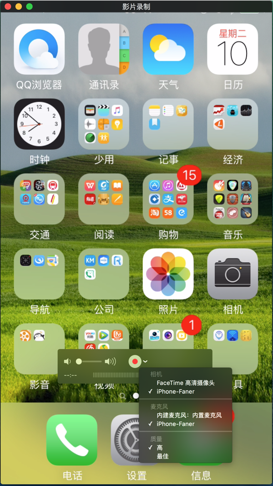-->

点击红色圆点按钮（变成方圆）开始录制手机屏幕，点按方圆按钮结束录制。  
录制期间可开启 iPhone 相机应用，进行拍摄视频，在 Mac 上可实时观看录制。

#### [Apowersoft](http://www.apowersoft.cn/)
[**Apowersoft** 免费在线录屏](http://www.apowersoft.hk/free-online-screen-recorder)是一款簡單實用的免費桌面錄製工具,它不僅適用於Windows的所有作業系統，也適用於Mac電腦。

> 使用 Apowersoft，不但可以錄製全螢幕，還可根據需求進行區域錄製。該軟體為用戶提供了多種錄製模式，包括全螢幕模式，自定模式，圍繞滑鼠錄製模式，影像鏡頭錄製模式和只錄製音頻模式。


<!--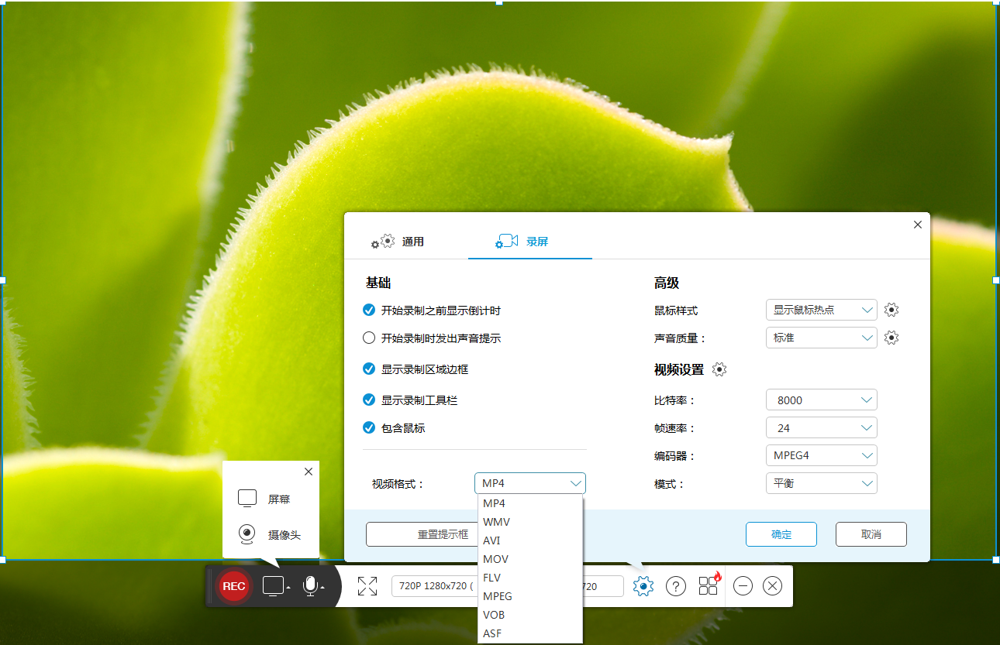-->


<!--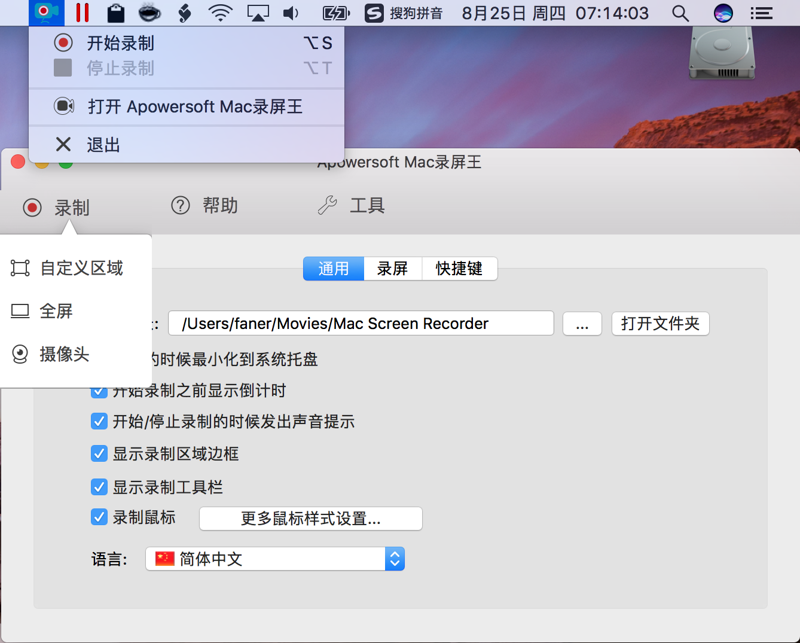-->

#### [**Camtasia**](https://www.techsmith.com/camtasia.html)
Camtasia for Win / Mac OS 是一款[顶级屏幕录像编辑工具](http://www.dayanzai.me/camtasia-studio-8.html)。除了基本的录像功能，Camtasia 也提供了丰富的视频剪辑加工功能。用户使用 Camtasia 可以方便地进行屏幕操作的录制和配音、视频的剪辑和过场动画、添加说明字幕和水印、制作视频封面和菜单、视频压缩和播放。

> - 强大的屏幕录像（Camtasia Recorder）
> - 视频剪辑和编辑（Camtasi Studio）
> - 视频菜单制作（Camtasia MenuMaker）
> - 视频剧场（Camtasi Theater）
> - 视频播放（Camtasia Player）  


<!--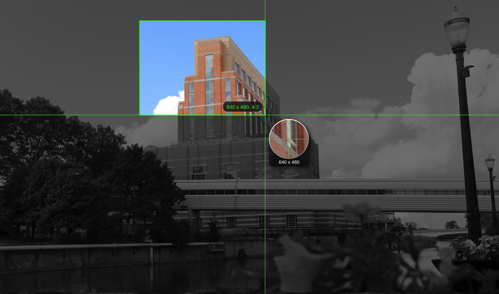-->


<!---->

#### [**LICEcap**](http://www.cockos.com/licecap/)
LICEcap for Win / Mac OS 是一款[小巧免费](http://xbeta.info/files/licecap.htm)、[灵活好用](http://www.appinn.com/licecap/)的 GIF [屏幕录制工具](http://osxdaily.com/2013/08/23/record-screen-animated-gif-mac-os-x/)。LICEcap 轻量灵活，直观易用，在录制过程中可以随意改变录屏范围。  
在博文《[socket基本概念及C/S通信模式](http://blog.csdn.net/phunxm/article/details/5085825)》和《[WinSock编程基础](http://blog.csdn.net/phunxm/article/details/5085869)》中即使用了 LICEcap 录制 OmniGraffle 绘制的包含动作的流程时序图。

录屏软件配合按键浮窗显示工具，可录制包含输入交互操作的日常演示视频：

> - 在 Windows 平台上，可搭配使用 [**Carnac**](http://code52.org/carnac/) [在屏幕实时显示按键操作](http://www.appinn.com/carnac/) 或 [**KeyCastOW**](https://brookhong.github.io/2014/04/28/keycast-on-windows.html) 将[按键操作进行可视化显示](http://www.appinn.com/keycastow/)；  
> - 在 Mac 平台上，可搭配使用 [**KeyCastr**](https://github.com/keycastr/keycastr) [在屏幕实时显示当前按键](http://mac.softpedia.com/get/Utilities/KeyCastr.shtml)。

以下示例综合示范了 LICEcap+KeyCastr 录制[使用 QuicktimePlayer 录屏]的教学视频，实现画中画录制效果。

> 1. 启动 KeyCastr 在屏幕左下角显示实时按键。  
> 2. 打开 LICEcap，调节其录屏窗口大小使其圈中 KeyCastr 键显浮窗和命令行窗口后，点击底部工具栏上的[Record]按钮**启动** LICEcap 录制。  
> 3. 启动 QuicktimePlayer 新建屏幕录制，拖动选择要录制的命令行窗口区域，点击【**开始录制**】。点击顶部菜单栏右上角任务栏中的方圆按钮**结束录制**。  
> 4. 点击 LICEcap 底部工具栏上的[Stop]按钮**结束录制**。


<!---->

#### ScreenToGif
[**ScreenToGif**](http://screentogif.codeplex.com/) for Win 是一款[免费小巧且实用的录屏软件](http://www.ithome.com/html/soft/147328.htm)，支持[將螢幕畫面操作记录錄影为 Gif 动画格式](https://briian.com/15950/screentogif.html)。

1. 运行 `ScreenToGif.exe` 将进入启动窗口，可选择 `录制屏幕`、`录制摄像头`、`录制画板` 或打开 `编辑器`。 
	 
	<!---->

2. ScreenToGif 的录制窗口和 LICEcap 比较相似，都是一个取景框。可调节帧率(FPS)、拉伸取景框大小；点击 `录制` 或 `停止`。  
	
	<!--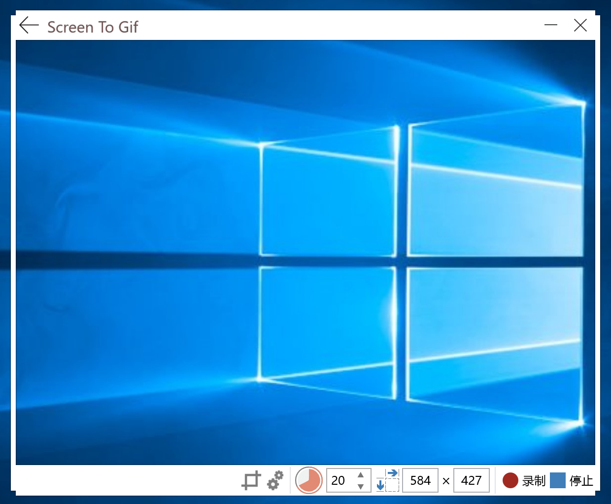-->

3. 录制过程中点击 `停止` 按钮完成后，将直接在编辑器中打开录制的视频帧。ScreenToGif 提供了丰富的编辑功能，可对录制的gif进行剪辑、拼接等二次加工。  
	
	<!--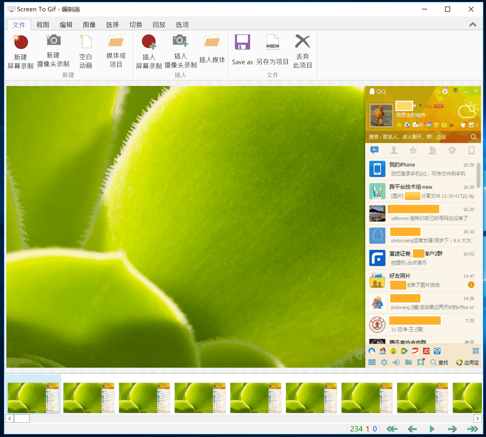-->
	> 在底栏时间轴中选择指定帧，可在之前插入新的屏幕录制或插入媒体（`*.gif`）；
	> 另存为项目（`*.stg`）或另存为（save as）Gif 或 Video。

4. 在**编辑**菜单中，可对录制或打开的文件进行编辑操作，包括复制、剪切、粘贴、删除指定帧（底栏时间轴可批量选择）、删除当前选择帧的前/后面所有帧、移动当前选择帧到左/右侧。  
	
	<!---->

5. 在**编辑**菜单中，针对当前帧图像，可进行调整大小、裁剪、翻转等操作；可插入文本、自由绘制、添加进度条、添加边框；甚至还可制作水印和Cinemagraph！  
	
	<!--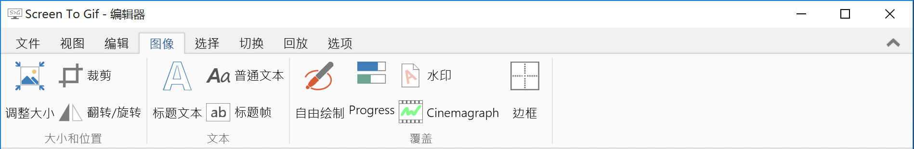-->

#### Screeny、Screen Flow、RecScreen
[**Screeny**](http://screenyapp.com/) for Mac: The simplest Screenshot, Screencasting and creen recording Tool. In fact, Screeny can record more frames per second than Apple's QuickTime!

---
[**Screen Flow**](http://www.telestream.net/screenflow/overview.htm) for Mac is Screencasting and video editing software. 

> - [Record everything](http://www.telestream.net/screenflow/features.htm#record)  
> - [Edit your video](http://www.telestream.net/screenflow/features.htm#edit)  
> - [Share with the world](http://www.telestream.net/screenflow/features.htm#share)  

> **ScreenFlow 使用参考教程**：[1](http://www.jianshu.com/p/c4d29b02a56c)，[2](http://www.jianshu.com/p/c1c1248efae0)，[3](http://www.jianshu.com/p/c2b3f14f70db)

---
[**RecScreen**](http://recscreen.com/) for Android/iOS  
可以将移动设备上的屏幕内容轻松录制下来，不需要连接电脑即可[直播手机游戏](http://bbs.feng.com/read-htm-tid-9587735.html)。作为多终端录制软件，RecScreen 是国内首家支持 iOS 系统免越狱录屏功能的工具。该软件支持录屏清晰度设置，方便用户控制视频大小和视频清晰度。


<!---->

### 格式转换
#### Video Converter

> [**HandBrake**](https://handbrake.fr/)（Windows/Mac OS/Ubuntu）：The open source video transcoder  
> [**AVC**](http://www.any-video-converter.com/)：Any Video Converter for free（[Windows](http://www.any-video-converter.com/products/for_video_free/)/[Mac OS](http://www.any-video-converter.com/products/mac_video_converter_freeware/)） 
> [**Video Converter Ultimate**](http://www.wondershare.net/mac-video-converter-ultimate/)（Windows/Mac OS）  
> **Apowersoft Video Converter**：[Mac OS](http://www.apowersoft.hk/video-converter-for-mac)/[Windows](http://www.sdbeta.com/xiazai/2014/1013/23256.html)/[Studio](http://www.apowersoft.cn/video-converter-studio)  
> [**Adapter**](https://www.macroplant.com/adapter/)：[Adapter](http://www.appinn.com/adapters/) Converts Video, Audio and Images（[Windows](https://www.macroplant.com/adapter/download/pc/)/[Mac OS](https://www.macroplant.com/adapter/download/mac/)）  
> [**Total Video Converter**](http://www.chinamac.com/download/mac85651.html)（[Windows](http://www.effectmatrix.com/total-video-converter/)/[Mac OS](http://www.etinysoft.com/total-video-converter-hd.html)）

使用 Apowersoft Video Converter 或 Total Video Converter 执行格式转换时，可选择多个视频文件进行**合并**。  
Total Video Converter 支持从视频文件中提取音频和视频；Apowersoft Video Converter 若转换设置音频为无，则可剔除音频，提取纯视频（可使用Elecard StreamEye打开查看）。提取视频后，可选择新的音频（Mac QT 录音、iPhone 语音备忘录或本地音频文件）合并到视频。如此，通过简单的剪辑配音可实现初级 MV 创作。  
若转换配置**添加字幕**（load subtitles），则可将外挂字幕压制合成到视频中。

### 视频分析
#### Elecard StreamEye Studio

```
Elecard StreamEye Studio is a set of  powerful applications comprising Elecard StreamEye, Elecard YUV Viewer, Elecard Video QuEst, Elecard Stream Analyzer, and Command line tool for automatic analysis.
```

[Elecard StreamEye Studio](http://www.elecard.com/products/products-pc/professional/streameye-tools/) 是一套强大的视频序列或码流分析软件，套件包括以下工具链：

- [Elecard StreamEye](http://www.elecard.com/en/products/professional/analysis/streameye4.html)
- [Elecard YUV Viewer](http://www.elecard.com/en/products/professional/analysis/yuv-viewer.html)
- [Elecard Video QuEst](http://www.elecard.com/en/products/professional/analysis/video-quest.html)
- [Elecard Stream Analyzer](http://www.elecard.com/en/products/professional/analysis/stream-analyzer.html)
- [Command line tool](http://www.elecard.com/en/products/professional/analysis/streameye-command-line.html)

[Elecard StreamEye Suite](http://www.lxway.com/125654811.htm) 套件是用于专业视频压缩、编辑和分析领域的功能强大的工具系列。它可视化的呈现视频码流结构，能够帮助用户对视频序列和容器封装格式（例如 MPEG4 的 [VS/VO/VOL/VOP](http://blog.csdn.net/phunxm/article/details/5735676)）进行直观分析和深入理解。

### [视频编辑](http://cn.wondershare.com/video/free-mov-video-editors.html)
无论是旅游观光还是亲友团聚，无论是自娱自乐还是婚庆典礼，我们都会拍摄一些视频记录日常生活的点滴。  
有了这些初级的多媒体素材之后，我们可以利用视频编辑软件工具对录制的视频进行剪辑，添加背景（背景乐）、片头（开场语）、转场（起承转合）、字幕（提词旁白）、片尾（结束语）等视效元素，为记忆添加节点，为时光添加注解。

#### Quicktime Player
Mac OS 预装的 Quicktime Player 除了可以播放 QT 影片外，还提供了简单的视频分离剪辑功能。

> [如何在 Mac 下編輯 QuickTime 文件](http://www.iskysoft.com.tw/quicktime/edit-quicktime-mac.html)
> [QuickTime Player 讓你 QuickCut](http://appleuser.com/2014/10/18/quicktime-player-quickcut/)
> [使用 QuickTime Player 剪辑与合成影片](http://www.macx.cn/thread-2030967-1-1.html)
> [QuickTime Player 螢幕錄影與影片剪輯](http://www.playpcesor.com/2014/03/mac-quicktime-player.html)
> [QuickTime Player 裁切、分割 MP3 音樂檔](https://briian.com/10175/mac-cut-mp3.html)

#### [iMovie](http://www.apple.com/mac/imovie/)
iMovie 可以导入媒体或直接拖拽资源库中的图片、视频、音频等素材创建影视剪辑**项目**。iMovie 资源库下的事件（*.imovieevent）和项目媒体存储在 `~/Movies/iMovie\ 资源库.imovielibrary` 目录。如果出现崩溃后，不能导入媒体素材，不能新建项目、事件，不能建文件夹，请尝试右键查看包内容，删除 `__Crash` 和 `__Temp` 目录后重启。如果未加载显示之前创建的项目，可以尝试右键使用 iMovie 打开 `iMovie 资源库.imovielibrary` 恢复导入。

iMovie 默认提供了公告、新闻、运动、旅行等现代有趣的主题模板。在视频中间可插入**静帧**、**背景**或照片，背景照片和前后片段之间可添加**交叉叠化**或其他**转场**过渡视效，可满足简单、连续画面或漫画风格的电子相册（相簿）等日常多媒体加工需求。

iMovie 项目可导入多个视频片段进行合并，在具体时间点可拆分片段或接合片段。剔除分离出的音频后，可导入新的音频合入。预览播放视频时，可显示音频波形。拍打唱词校对时间轴时，可在具体时间点插入标记（M）。

iMovie 默认提供了丰富的片头、报幕、旁白、片尾等**字幕**模板，插入选定的字幕模板后，可编辑字幕，调整字体、颜色及对齐。当前主题的模板字幕也可局部编辑。

> [如何使用 iMovie](http://zh.wikihow.com/%E4%BD%BF%E7%94%A8iMovie)
> [使用 iMovie 创建电子相册](http://bbs.feng.com/read-htm-tid-440887.html)
> [使用 iMovie 轻松制作视频短片](http://www.3haoweb.cn/a/software/media/2012/0503/9395.html)
> [使用 iMovie 给视频添加字幕](http://www.391k.com/pingce/76138.html)
> iMovie for iOS [新手入门](http://sspai.com/28102) / [详尽教程](http://www.cnmo.com/soft/133655_all.html)

#### [Final Cut Pro X](http://www.apple.com/cn/final-cut-pro/)
[Final Cut Pro X](https://itunes.apple.com/cn/app/final-cut-pro/id424389933?mt=12)(FCPX) 是 Mac OS 平台上最好的非线性视频剪辑软件，Final Cut Pro X 为原生64位软件，基于 Cocoa 编写，支持多路多核心处理器，支持GPU加速，支持后台渲染，可编辑从标清到 4K 的各种分辨率视频，ColorSync 管理的色彩流水线则可保证全片色彩的一致性。

[Final Cut Pro X](http://www.apple.com/cn/final-cut-pro/all-features/) 的主要特点就是为用户提供“**磁性时间线**”，该功能允许用户编辑灵活、无轨的项目。Final Cut Pro X 的另一项主要革新是**内容自动分析**功能，载入视频素材后，系统可在用户进行编辑的过程中，自动在后台对素材进行分析，根据媒体属性标签、摄像机数据、镜头类型，乃至画面中包含的任务数量进行归类整理。

> [Final Cut Pro 還是 Premiere ？](http://www.videoblog.hk/%E3%80%90%E6%96%B0%E6%89%8B%E7%96%91%E9%9B%A3%E3%80%91final-cut-pro-%E9%82%84%E6%98%AF-premiere-%EF%BC%9F/)
> [Final Cut Pro X 自学第一站](http://www.17v5.com/)
> [Final Cut Pro X 入门到精通教程](http://www.qinxue.com/147.html?sysref=finalcut)
> [Final cut pro X 影视剪辑与调色中文视频教程](http://mp.weixin.qq.com/s?src=3&timestamp=1463368243&ver=1&signature=36upaaY9ieZIP*h3MAZy0pYXK1raaYry5AOCn7u4up6lGiMKUhbFyMjeSRX0i*tU9lOdrSsRiMA2Pz7zU-ZNDCJT9vXLSDQ-X*ZM*V6iAAU*LveTseAf376lpVTFcXt77l2z7bOAhOyLfjeQ536QSw==)

### 视频字幕
#### [字幕格式](http://blog.csdn.net/zzqhost/article/details/6186295)
**歌词格式**的字幕主要有 [LRC](http://www.cnlyric.com/) 和 [KSC](http://www.lantiange.cn/) 两种，用于 MTV 和卡拉OK（Karaoke）。

lrc是英文lyric（歌词）的缩写，被用做歌词文件的扩展名。  
LRC 歌词是一种包含着 `:` 形式“标签(tag)”的、基于纯文本的歌词专用格式。其文本语法非常简单，行格式为 `[分钟:秒.毫秒] 歌词`。以 lrc 为扩展名的歌词文件可以在各类数码播放器中同步显示。

若想实现卡拉 OK 动态滚词功能，则需要使用 KSC 格式。KSC 格式用于生成卡拉 OK 字幕素材，此格式可制作出令人激动的卡拉 OK 字幕，保存在 CDR 盘片上，通过计算机或 VCD，SVCD 和 DVD 机器播放它们即可同步动感显示。

可使用 [**小灰熊**（KBuilder）](http://www.xmsdev.com/) 制作 KSC 歌词，也可使用 lrccon [歌词字幕在线转换器](http://www.lrccon.com/convert.php) 将 [LRC/SRT/UTF/KSC/SSA/ASS/SMI](https://shansing.com/read/392/) 等源格式转换为 LRC/SRT/UTF/KSC/SSA/ASS/SMI/SNC/TXT 等目标格式。

---

现在比较流行的[影视字幕格式](https://zh.wikipedia.org/wiki/%E5%AD%97%E5%B9%95%E6%A0%BC%E5%BC%8F)分为 `图形格式` 和 `文本格式` 两类。  

**图形格式**字幕由 idx 和 sub 文件组成。

- `idx` 相当于索引文件，包括了字幕出现的时间戳和字幕显示的属性；`sub` 文件就是字幕数据本身，加载字幕的时候选择idx即可。  
- `idx+sub` 可以存放多种语言的字幕，在播放时可方便地按需选择本地语言版本。由于是图片格式，所以占用空间较大，动辄 10M 以上。

**文本格式**字幕常见的扩展名有 srt、sub (Micro DVD）、ssa、ass 或 smi。

- [**SRT**](http://assrt.net/xml/list/sub/)（Subripper）是最简单的文本字幕格式，其后缀名为.srt。其组成为一行字幕序号 + 一行时间代码 + 一行字幕数据。SRT 和 SUB一般用于外挂字幕，也可以用于内镶时的普通对白，其制作和修改非常简单。如果下载到外挂的.srt格式双语字幕，用文本编辑器打开英文字幕文件，将时间戳相同的中文字幕文件内容复制粘贴到末尾即可合成双语字幕效果。  
- [**SSA**](http://www.zimuzu.tv/)（Sub Station Alpha）是为了解决 SRT 效能过于简单而开发的高级字幕格式。SSA格式字幕的扩展名为.SSA，采用SSA V4脚本语言，能实现丰富的字幕功能。除了能设定不同字幕数据的大小和位置外，更能实现动态文字和水印等复杂的功能。  
- [**ASS**](http://www.subhd.com/)（Advanced SubStation Alpha）是更高级的 SSA 版本，可以自定义字体、颜色，采用SSA V4+ 脚本语言编写。SSA 与 ASS 除了可做普通对白，常用于制作**特效字幕**，实现诸如卡拉OK、变色、翻转、大小的改变、移动、透明等特效。  
- [**SMI**](http://www.zimuku.net/)（Sami），其扩展名为.smi，是 Windows Media Player 专用的字幕文件格式。如果在播放的文件目录中有格式正确且与歌曲同名的 SMI 文件，那么 WMP 就会自动识别加载显示。SMI和SRT一样都是文本字幕格式，可以用记事本或者E-Lyric打开进行编辑。

> [制作 smi 字幕文件的方法](http://bbs.pfan.cn/post/369369.html)  
> [如何用excel把smi字幕转成srt字幕](http://blog.sina.com.cn/s/blog_4c8bb86b0100cc2k.html)  
> [图解如何将smi字幕转换成srt格式？](http://www.360doc.com/content/11/0306/01/5078515_98518063.shtml)  

#### 字幕制作
使用 iMovie 可对视频进行简单的剪辑，添加了背景、片头、转场、片尾等元素后，可考虑添加字幕为记忆增加旁白。尤其是对于自弹自唱这种现场DV，添加字幕实现声文同步，使得观感及视效体验更加丰富。

1. Mac OS 自带的 **iMovie** 即支持添加字幕。iMovie 字幕主要选用「[**苹方-简**](https://www.zhihu.com/question/19693837)」（PingFang SC）系字体，格式丰富、视效良好。拍打唱词需反复试听，校对时间轴进行M标记掐时打点，逐句手工输入字幕，耗时费力效率较低。

2. [**Arctime**](http://www.arctime.org/) 字幕制作软件可[自动分轴](http://filmaker.cn/thread-61566-1-1.html)，支持基于导入的纯文本或SRT数据进行编辑。快速拖拽逐行句插入字幕快，操作非常便捷且易于精微调节。制作完成后，除了可导出多种格式（TXT、EXCEL、LRC、SRT、ASS、Micro DVD[`*.sub`]、Spruce STL[`*.stl`]、WebVTT[`*.vtt`]、）的外挂字幕文件外，还可直接压制输出合成视频。  
	常用字幕字体如下：  

	> - **ARCTIME HEITI** - ArcTime 字幕软件标准黑体；[**字幕黑体M**](http://www.ddooo.com/softdown/51106.htm)（[SubtitleGothicMedium](http://font.chinaz.com/810238060.htm)）  
	> - [细明体](http://tc.wangchao.net.cn/zhidao/detail_2599328.html)（MingLiU）、[**新细明体**](https://zh.wikipedia.org/wiki/%E6%96%B0%E7%B4%B0%E6%98%8E%E9%AB%94)（PMingLiU「-ExtB」）  
	> - **娃娃体**-简（WawaSC）、雅痞-简（YuppySC）、手札体-简（Hannotate）、方正稚艺简体  
	> - **冬青黑体**（[Hiragino](https://zh.wikipedia.org/wiki/Hiragino) Sans GB）、[**兰亭黑**-简](https://zh.wikipedia.org/wiki/%E6%96%B9%E6%AD%A3%E5%85%B0%E4%BA%AD%E9%BB%91)（Lantinghei SC）、[思源黑体](https://zh.wikipedia.org/wiki/%E6%80%9D%E6%BA%90%E9%BB%91%E9%AB%94)（[Noto Sans CJK](https://www.google.com/get/noto/help/cjk/)/[Source Han Sans](http://blogs.adobe.com/conversations/tag/noto-sans)）、[信黑体](www.xingothic.tw/)（[Xingothic](www.vmtype.com/index_e.html)）  
	> - [**造字工房**](http://www.makefont.com/)-悦黑、典黑、朗倩、尚黑、佳黑，朗宋、品宋，雅圆、悦圆。  

3. 可使用[雷特小篆字幕制作滚屏字幕](http://blog.163.com/qywwkai@126/blog/static/21003042201511844028244/)；也可使用[**爱剪辑**（iJianJi）](http://www.ijianji.com/index.htm)给视频导入 KSC 歌词添加卡拉 OK 动感特效字幕。

> [使用飞华DV视频字幕合成伴侣制作KSC歌词](http://www.docin.com/p-396692945.html)  
> 使用小灰熊字幕工具制作卡拉ok字幕：[1](http://jingyan.baidu.com/article/a24b33cd706cd719fe002be2.html) / [2](http://100114.blog.51cto.com/90114/33241/) / [3](http://www.veryhuo.com/a/view/107124.html)  
> 使用爱剪辑软件给视频 [添加MTV字幕特效](http://www.ijianji.com/article/MTVzimu.htm) 或 [卡拉OK字幕特效](http://www.ijianji.com/article/kalaokzimu.htm)  
